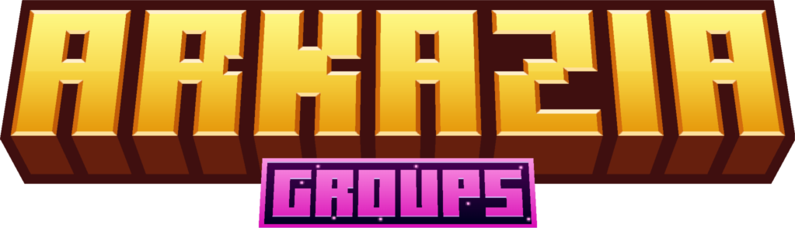

<h1 align="center">
 Hi there 👋
</h1>

> [!IMPORTANT]
> the project takes more time to progress during these holidays

<h3 align="center">
Welcome aboard the Arkazia organization 🏴‍☠️
</h3>

> We're thrilled to have you join our virtual haven dedicated to the captivating world of piracy on Minecraft Bedrock Edition. ⚓️

<h2 align="center">
About Arkazia 🌊
</h2>

**Arkazia** is much more than a mere server, it's an extraordinary adventure that immerses you in the turbulent waters of an uncharted pirate realm. Our server is powered by <a href="https://github.com/PowerNukkitX">PowerNukkitX</a>, a revolutionary Java software tailored for the Bedrock edition of Minecraft, ensuring a gaming experience that's both seamless and exhilarating.

<h2 align="center">
🏴‍☠️ Join the Pirate Brotherhood  !
</h2>

Welcome to the ruthless, thrilling, treasure-filled world of Arkazia ! Check out our <a href="https://discord.gg/eF79vESm5S">New Pirate's Guide</a> to familiarize yourself with the rules of the game and dive headfirst into the action.

<h3 align="center">
Hoist the sails and set forth together on an unparalleled pirate adventure ! 🦜
</h3>
&nbsp

<h2 align="center">
Meet the creators ❤
</h2>

- @AzaleeX
- @Nya-Enzo
- @PilpoilMC
- @NoaQRArkasus

<h4 align="right">
Social Media
</h4>

  
  

